Super-Meta-X (SMX) Enterprise

Advanced Meta-Analysis & Data Synthesis Platform

Fig 1: Main Dashboard & Import Pipeline

Overview

Super-Meta-X (SMX) Enterprise is an advanced, automated statistical environment designed for comprehensive meta-analysis and evidence synthesis. Built natively on the R meta and metafor ecosystems, SMX provides an interactive, enterprise-grade interface for complex data reshaping, robust variance estimation, missing data imputation, and high-fidelity geometric visualizations optimized for immediate manuscript integration.

Key Features

📥 Advanced Data Pipeline & Imputation

Multi-Format Ingestion: Native support for Standard Matrices (CSV, Excel, SAS, SPSS) and Cochrane RevMan Archives (.rm5).

Data Diagnostics (EDA): Immediate distributional geometries, mapping, and five-number summary statistics.

Quality Control: Automated filtering rules to purge NA values and duplicate arrays prior to analysis.

Non-Parametric Imputation: Integrated MICE (Multiple Imputation by Chained Equations) engine to intelligently handle missing data vectors.

🧮 Core Analytical Engine

Statistical Equivalency: Algorithms run natively against standard implementations of R's meta and metafor packages.

Cluster-Robust Variance: Incorporates Sandwich Estimators to handle structural study clusters dynamically.

Influence & Isolation Algorithms:

Iterative Leave-One-Out (LOO) Matrices

Viechtbauer-Cheung Diagnostics

Map Baujat Dimensionality

Combinatorial GOSH Extrapolation

Fig 2: Influence Algorithms, GOSH Array & Iterative LOO Mapping

📊 High-Resolution Geometries & Topography

Primary Forest Mapping: Chronological hierarchical ordering, interactive I² and τ² indices, and proportional weight vector visualization.

Advanced Projections: Galbraith Structural Radials, Drapery P-Value Projections, Confidence Limit Topologies, and Proportional Bubble Geometries.

Bias Integration: Direct integration with Risk of Bias 2 (RoB 2) instruments for RCTs.

Fig 3: Precision vs. Standardized Effect (Galbraith Structural Radial)

📉 Sensitivity & Bias Detection

Component

Description

Distributional Asymmetry

Trigger base asymmetry protocols using Egger's Regression rules.

Doi & LFK Modeling

Construct Doi plots and extract LFK indices to quantify publication bias.

Weight-Function Heuristic

Negative Exponential Curve modeling to fit publication weight models.

Outlier Filtration

Execution of heuristic filters for structural outlier isolation and RVE logic.

🔍 Moderator Analysis (Meta-Regression)

Categorical Stratification: Re-calculate pooling architectures within partitions with Q-test execution for between-group structural deviations.

Linear Mixed-Effects Regression: REML parameter optimization matrices with mean-centering capabilities for continuous numeric covariates.

📑 Pipeline I/O & Reporting

Automated Compilation: Trigger RMarkdown compilation sequences to generate HTML application outputs or embed primary geometries directly.

State Preservation: Write active RAM memory matrices directly to .rds disks and securely re-hydrate host memory across sessions.

Execution Telemetry: Built-in interception of mathematical flags (e.g., division by zero, rank deficiencies) to ensure server stability.

Technical Stack

Engine/Environment: R · RStudio / Shiny Server

Statistical Libraries: meta · metafor · mice · clubSandwich

Visualization: Custom ggplot2 outputs optimized for academic publication

Reporting: RMarkdown · HTML/PDF Compilation

Author

Dr. Salman Khalid, MBBS King Edward Medical University (KEMU), Class of 2024

Portfolio: salman24012715.github.io

Email: salman24012715@gmail.com

Institutional: salmankhalid@kemu.edu.pk

ORCID: 0009-0006-3471-2710

License

© 2024–2026 Dr. Salman Khalid. All rights reserved.
This software is proprietary. You may view this repository for evaluation purposes only. Copying, modification, distribution, commercial use, or creation of derivative works is strictly prohibited without prior written permission. See LICENSE for full terms.

Complete Visual Reference Gallery

Below are additional structural and interface references from the Super-Meta-X PDF:

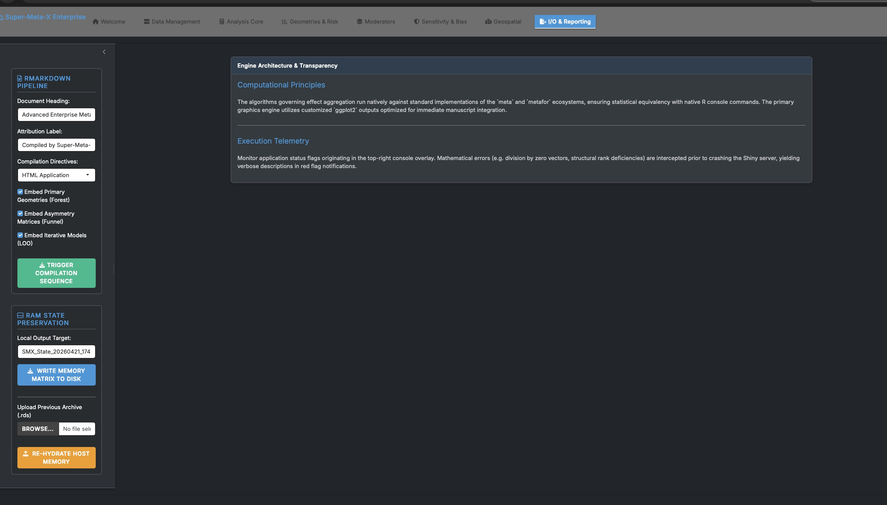
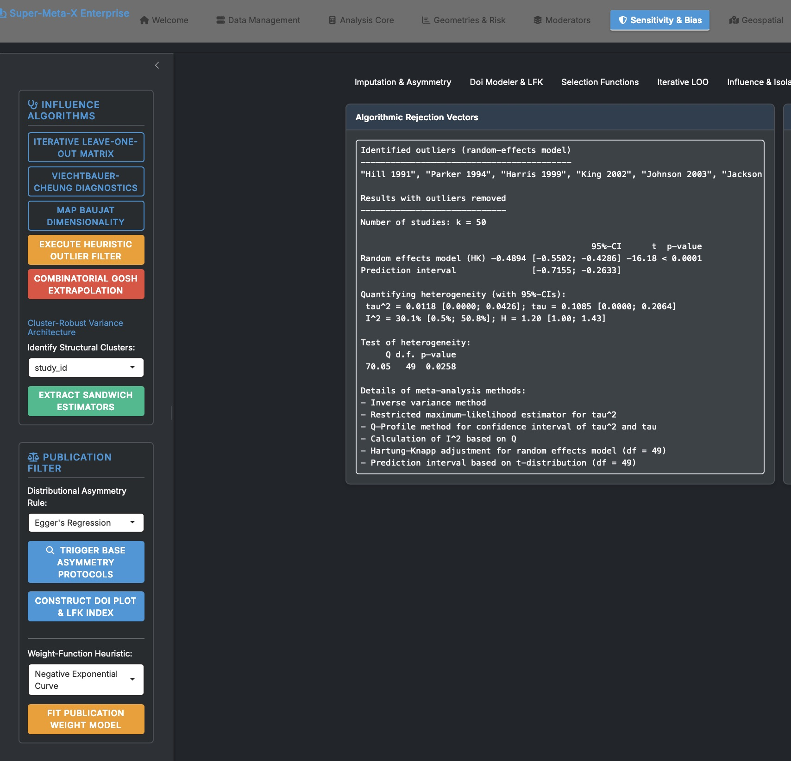
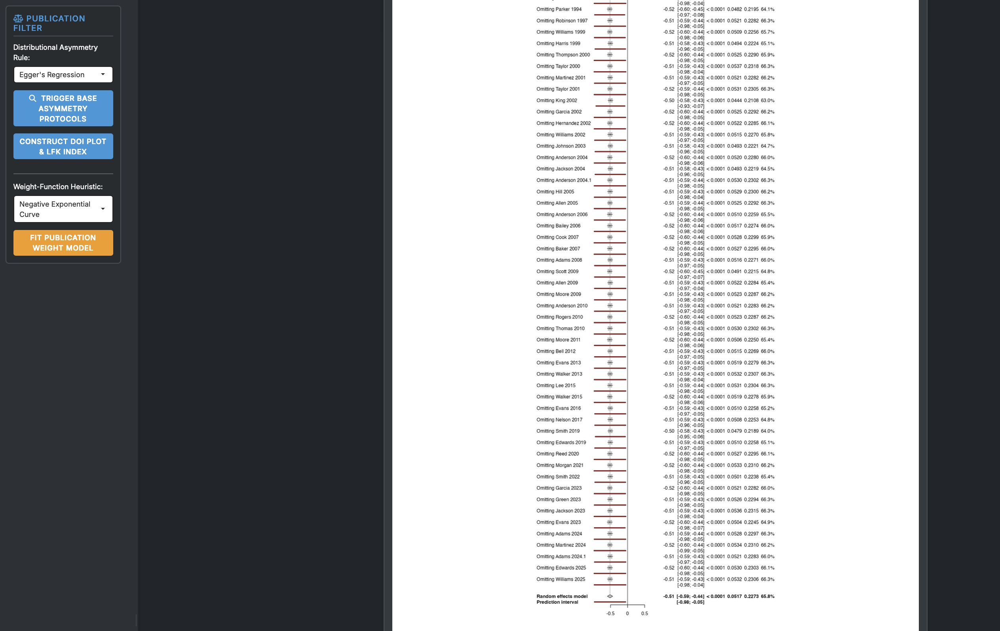
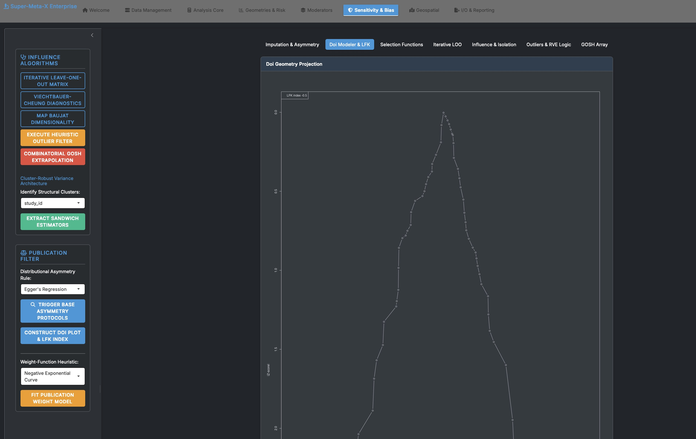
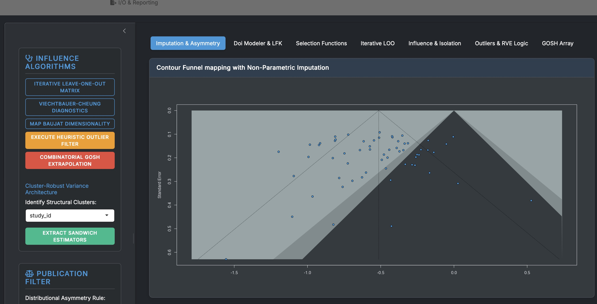
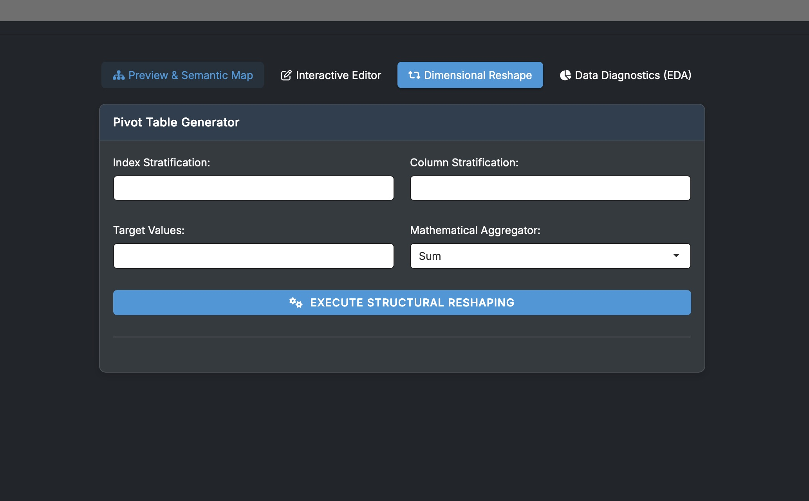
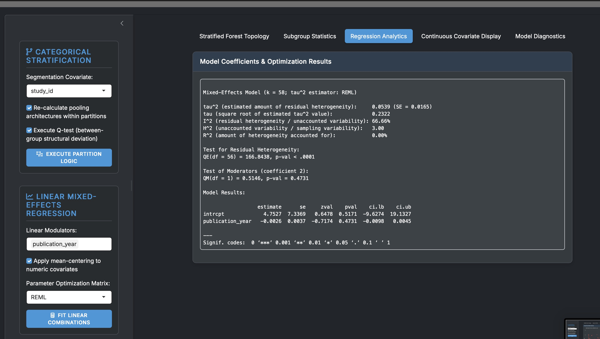
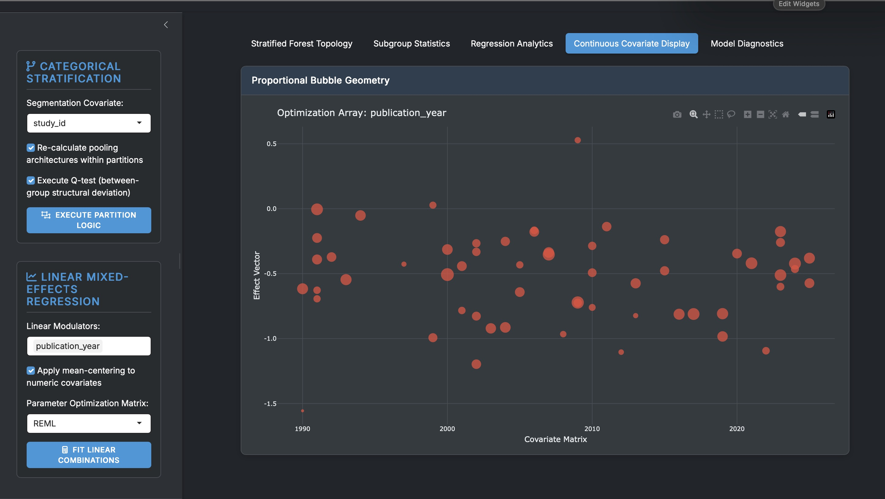
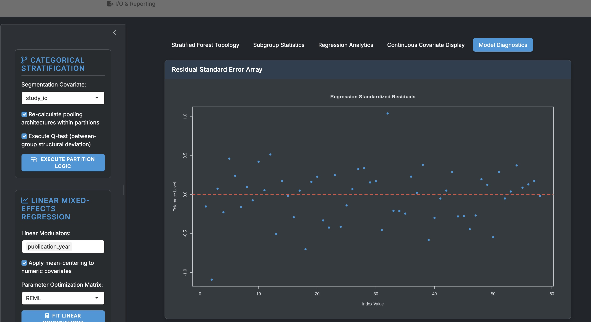
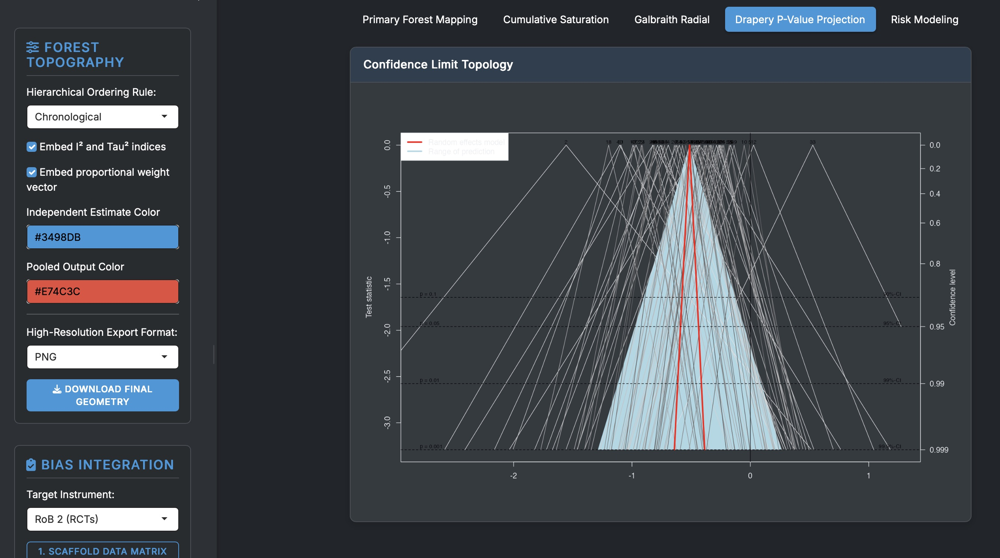
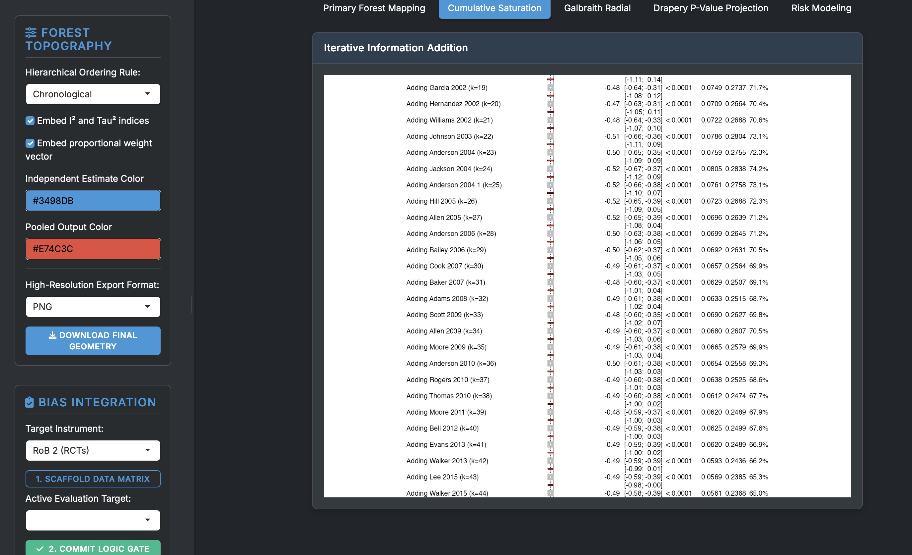
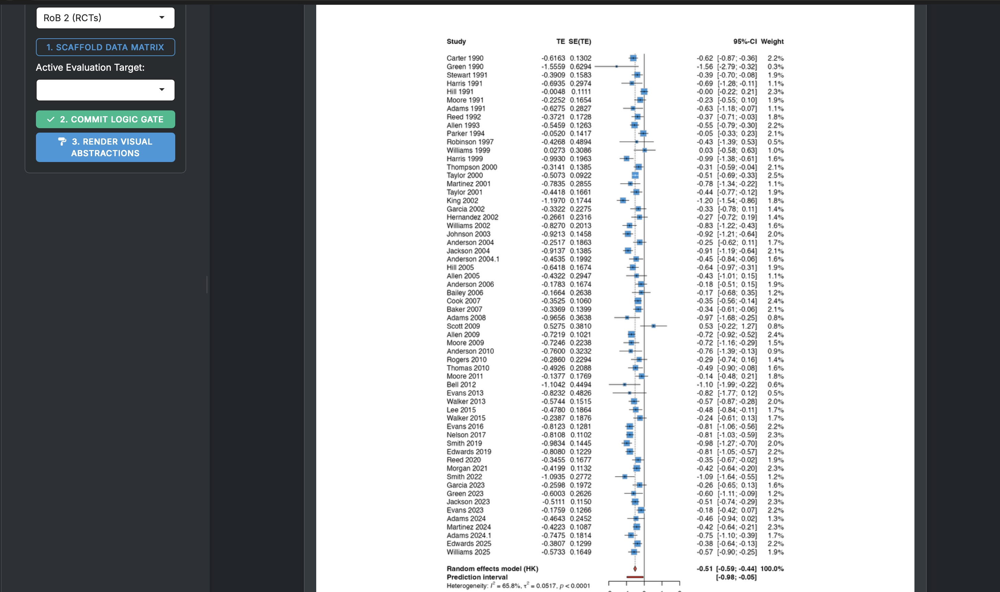
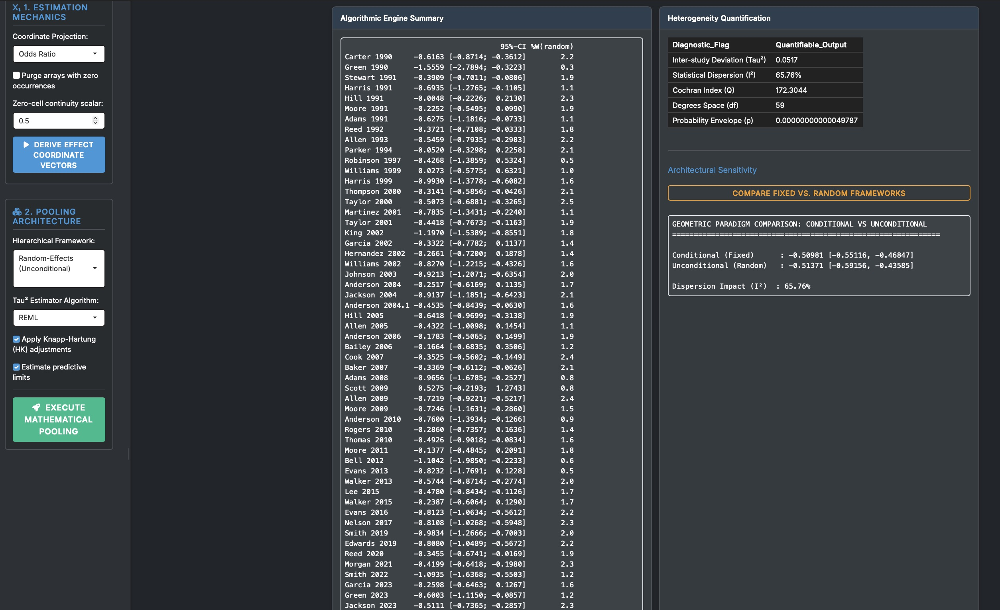
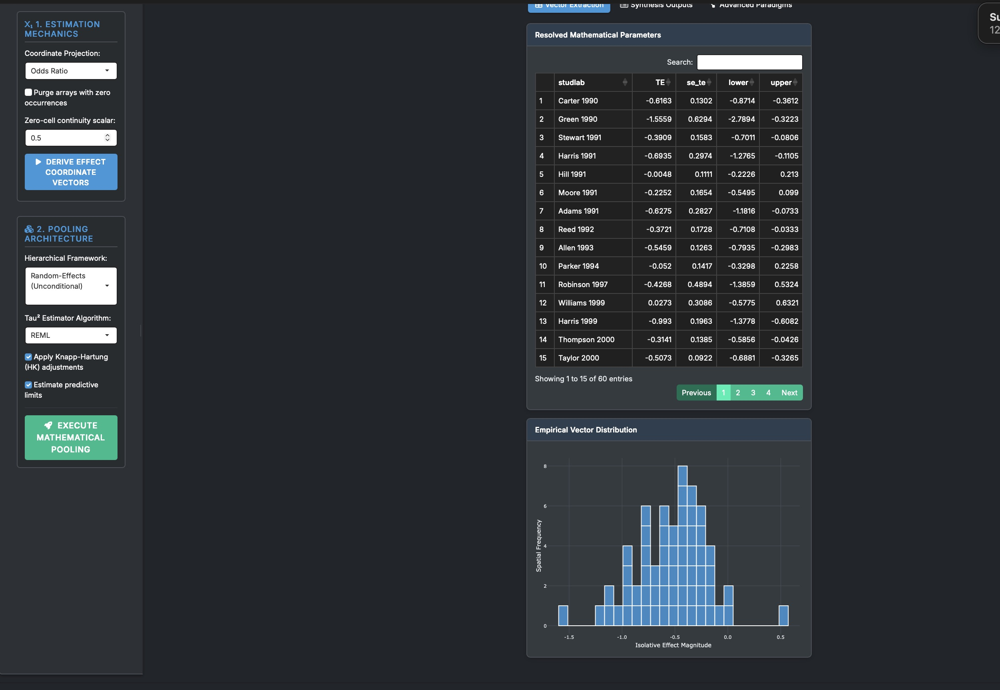

